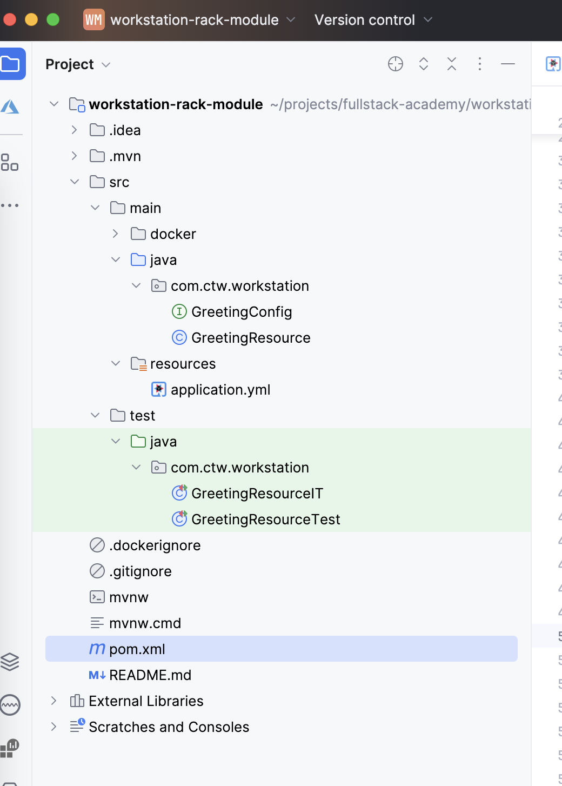
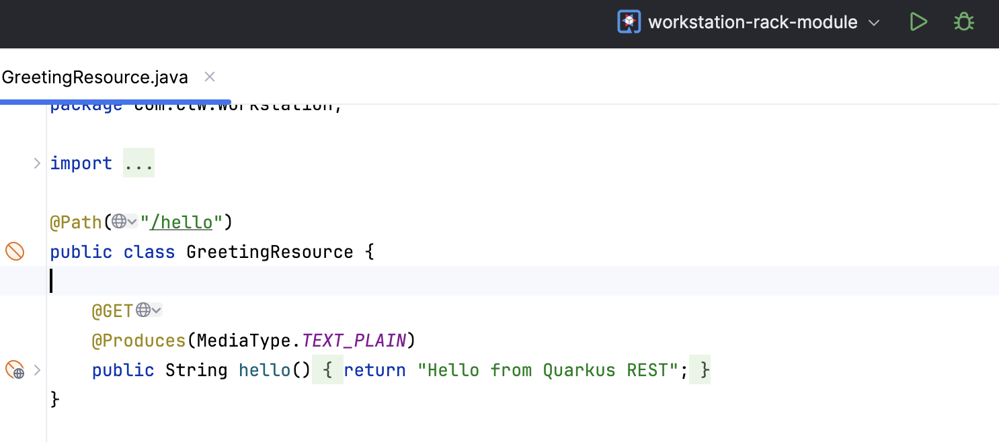
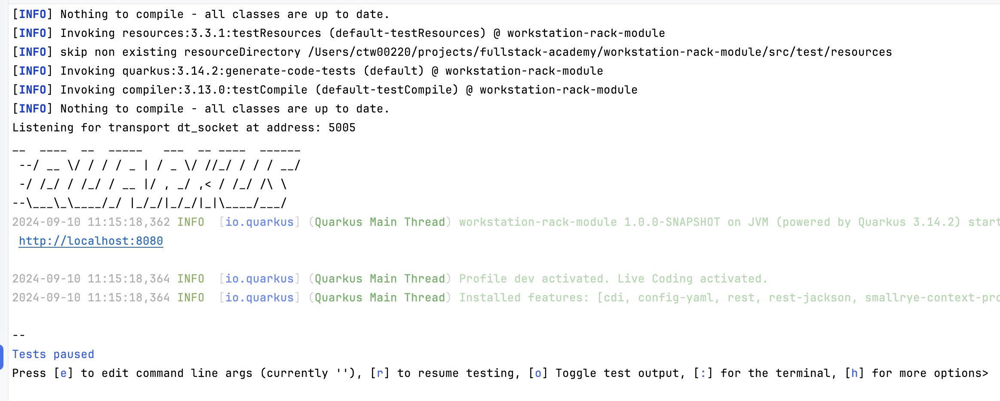
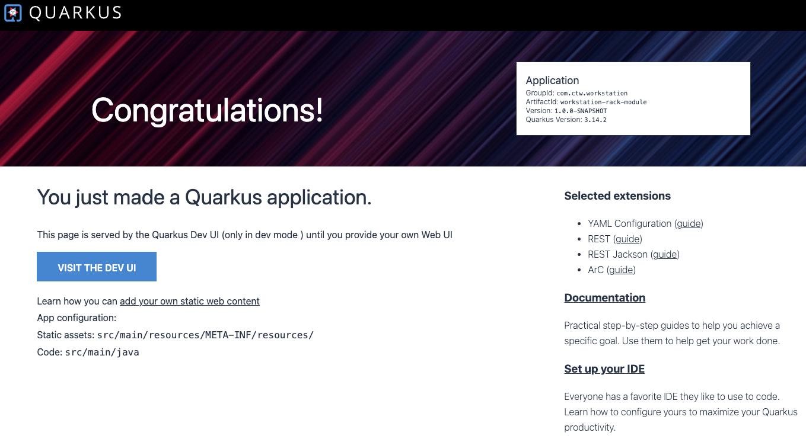
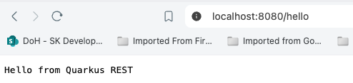

# Create a microprofile application

From this module on we are going create our Rack Booking System Application.
As you know from the previous module, a rack is a piece of hardware that contains multiple computers that emulate part
of a car.
We will start in this module and evolve with the next modules.

The goal for this exercise is to create our first microprofile
application running in an application server. In our case we are going to use [Quarkus](https://quarkus.io/) as our application server.

Use the following command to create a new Quarkus project

   ```
   mvn io.quarkus.platform:quarkus-maven-plugin:3.14.2:create \
    -DprojectGroupId=com.ctw.workstation \
    -DprojectArtifactId=workstation-rack-module \
    -Dextensions=quarkus-rest,quarkus-rest-jackson,quarkus-config-yaml

   ```

Also you can go to [Quarkus Stard Code](https://code.quarkus.io/) and explore all extensions and options that you have to create a new application.

Open the new project in your IDE, it should like this:



Take your time to explore the project structure.

You can run the application by using the following command:

```
./mvnw compile quarkus:dev
```

Or you can use the IDE to run or debug:



You should see in your console logs:



Teste you application by using a browser, open [http://localhost:8080/](http://localhost:8080). You should see the following response:



You can also test the REST API by opening [http://localhost:8080/hello](http://localhost:8080/hello).




You are ready to start coding!