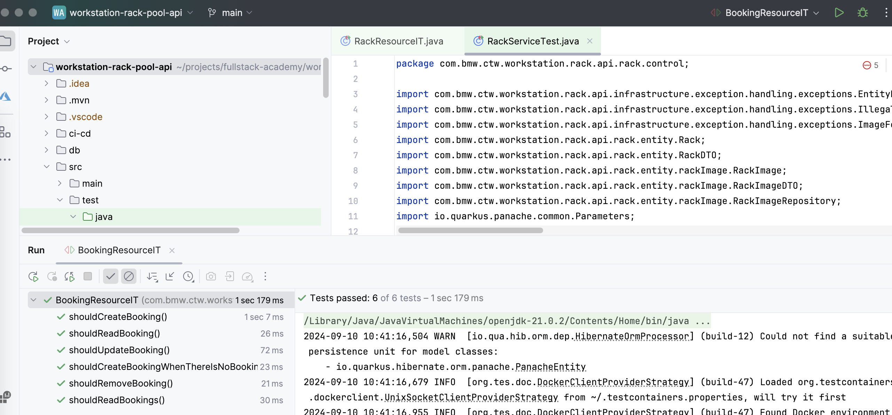

# Automated testing

Is testing time! At this point you should have a functional Quarkus application. Let's add some automated tests to make sure that it works as expected.

We'll use [Junit](https://junit.org/junit5/) and [Rest-Assured](https://rest-assured.io). Take your time to read the documentation of both frameworks to understand how they work.

If you follow everything correctly, you should have your application setup with [Quarkus Dev Services](https://quarkus.io/guides/dev-services), you won't need to do any extra work to start the tests, Dev Services will take care of the necessary dependencies like a database.

You can read more about testing Quarkus applications [here](https://quarkus.io/guides/getting-started).

## Maven dependencies

Check your "pom.xml", you should have the following dependencies:

        <dependency>
            <groupId>io.quarkus</groupId>
            <artifactId>quarkus-junit5</artifactId>
            <scope>test</scope>
        </dependency>

        <dependency>
            <groupId>io.rest-assured</groupId>
            <artifactId>rest-assured</artifactId>
            <scope>test</scope>
        </dependency>

Otherwise, add them to your project.

## Running the tests

To run all the tests using the command line:

    ./mvnw verify

You can also run using your IDE, just select the desire test our all and hit the play button:

