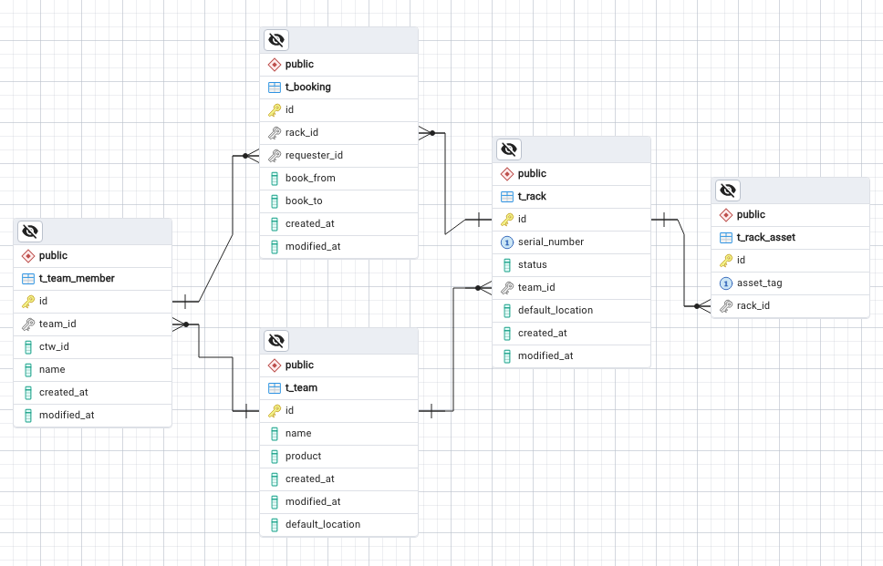

# Create DB

The goal for this exercise is to create a database for a Rack's Booking System.
Take a look at the sample DB and create the necessary SQL scripts for it.

1. Create a new relation named “T_TEAM” which should contain the attributes (id, name, product,
   created_at, modified_at, default_location);
    1. The default locations should be 'Porto', 'Lisbon' or 'Braga';
2. Create a new relation named “T_TEAM_MEMBER” which should contain the attributes (id, team_id,
   ctw_id, name, created_at, modified_at);
3. Create a new relation named “T_RACK” which should contain the attributes (id, serial_number,
   status, team_id, default_location, created_at, modified_at);
    1. The allowed status are 'Active', 'Returned', 'Repair', 'Outdated', 'Bricked';
4. Create a new relation named “T_RACK_ASSET” which should contain the attributes (id, asset_tag,
   rack_id);
5. Create a new relation named “T_BOOKING” which should contain the attributes (rack_id, requester_id,
   book_from, book_to, created_at, modified_at);

